# 🖼️ Mockup & Dokumen Visual Premium - SakuCerdas

Dokumen ini berisi representasi visual lengkap dari seluruh fitur utama aplikasi **SakuCerdas**. Semua tampilan di bawah ini diambil dari sistem yang sudah terisi dengan data simulasi riil untuk memberikan gambaran penggunaan yang nyata.

---

### 1. Dashboard Utama (Financial Overview)
Pusat kendali keuangan yang menampilkan saldo bersih, ringkasan pemasukan/pengeluaran bulan ini, indikator streak menabung, serta kartu berita literasi keuangan terbaru.
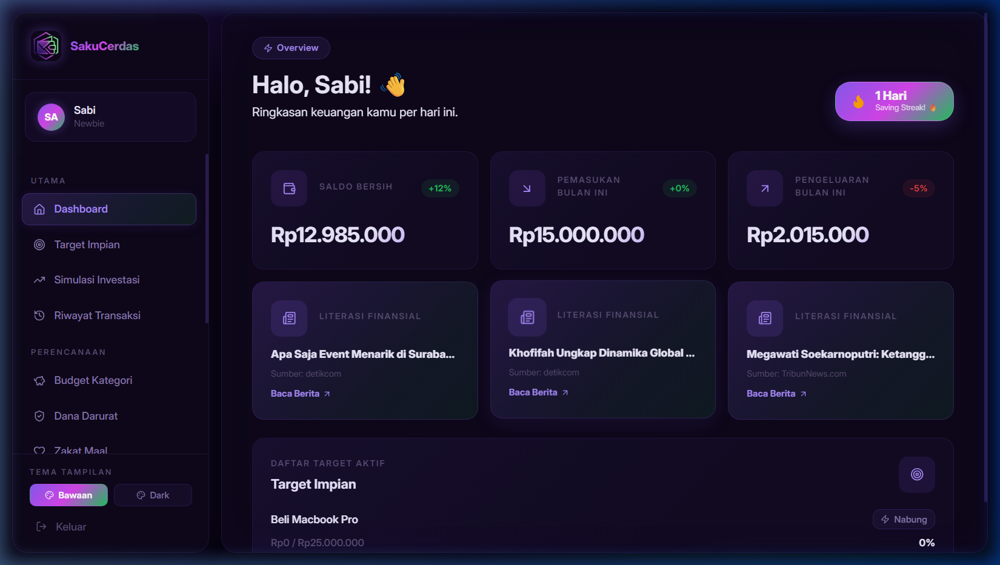

---

### 2. Target Impian (Goal Tracking)
Fitur untuk merencanakan pembelian barang atau pencapaian impian. Menampilkan progress bar interaktif dan kategori target yang sedang berjalan.
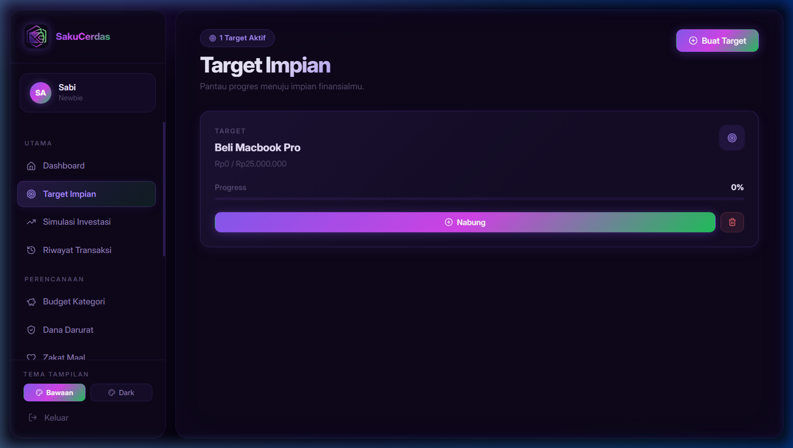

---

### 3. Riwayat Transaksi (Transaction History)
Catatan mendetail seluruh aktivitas keuangan dengan label kategori yang jelas dan pemisahan antara pemasukan serta pengeluaran.
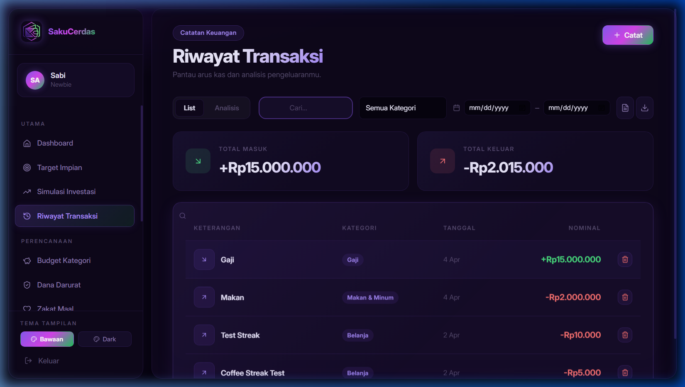

---

### 4. Simulasi Investasi (Growth Projection)
Kalkulator pintar untuk memproyeksikan pertumbuhan aset di masa depan menggunakan rumus bunga majemuk, lengkap dengan visualisasi angka yang jelas.
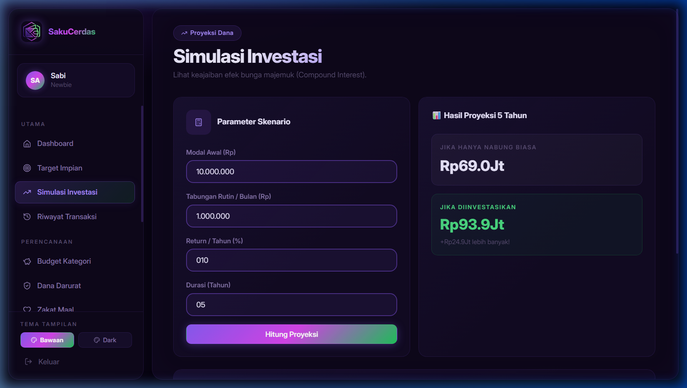

---

### 5. Budget Kategori (Expense Control)
Sistem pembatasan pengeluaran per kategori. Membantu pengguna memantau apakah mereka masih dalam batas aman anggaran atau sudah mendekati limit (overbudget).
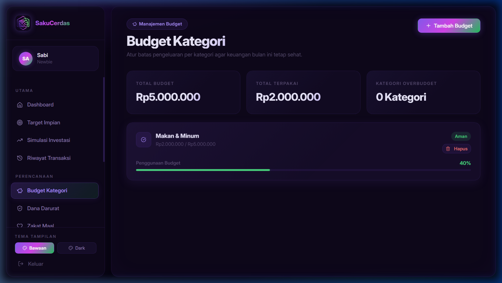

---

### 6. Dana Darurat (Emergency Fund)
Kalkulator kebutuhan dana cadangan berdasarkan status perkawinan dan pengeluaran bulanan rata-rata untuk menjamin keamanan finansial.
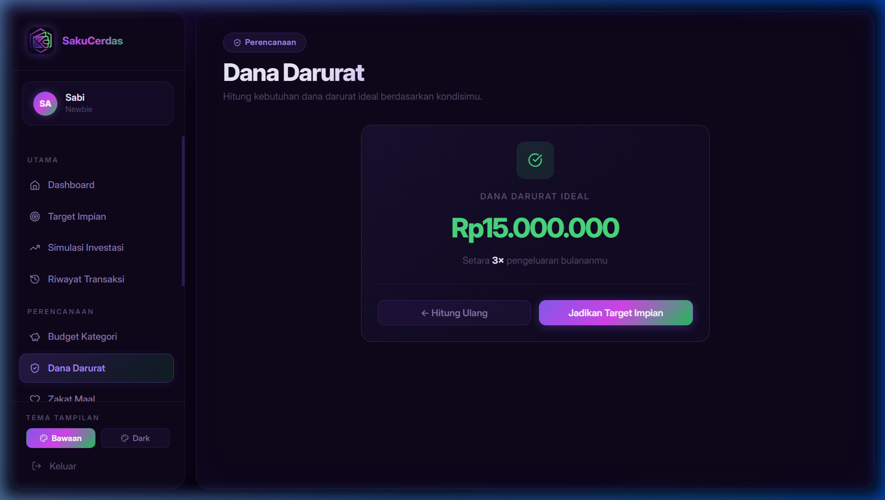

---

### 7. Zakat Maal (Religious Calculator)
Fitur penghitungan zakat harta secara otomatis berdasarkan input kekayaan saat ini dan nishab emas yang berlaku.
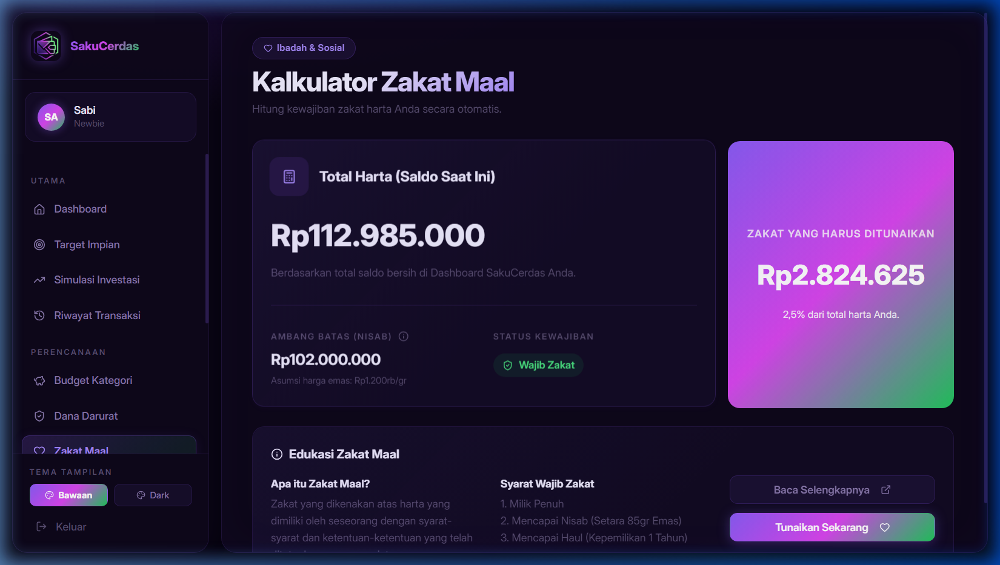

---

### 8. Sub & Rutin (Recurring Bills)
Manajemen untuk pengeluaran tetap bulanan seperti langganan Netflix, biaya sekolah, atau tagihan rutin lainnya agar tidak terlupakan.
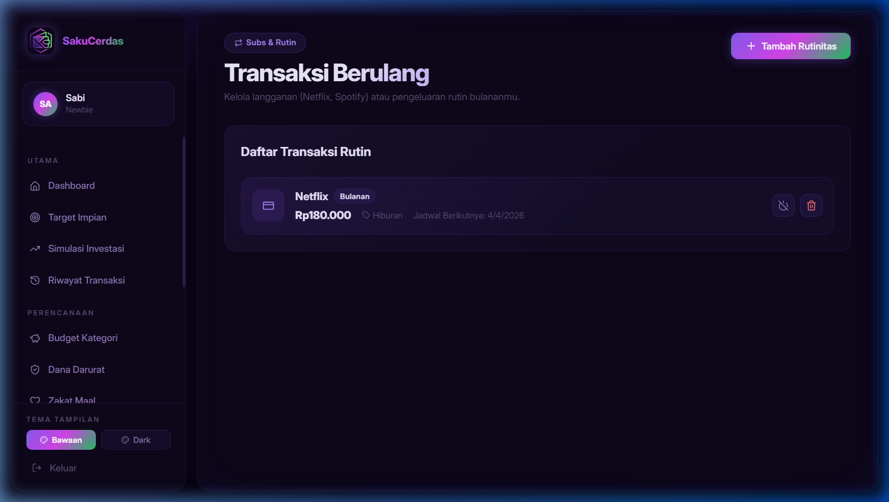

---

### 9. Hutang & Piutang (Debt Management)
Buku catatan untuk mengelola pinjaman yang kita berikan kepada orang lain atau hutang yang perlu kita bayar pelunasannya.
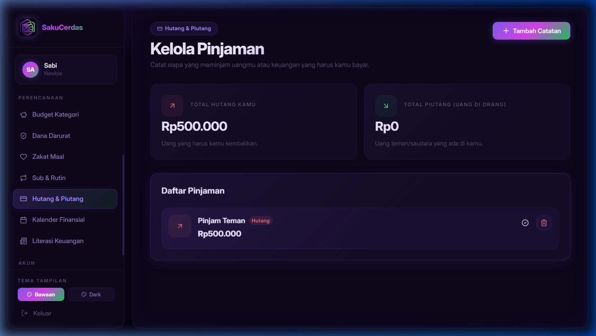

---

### 10. Kalender Finansial (Financial Calendar)
Visualisasi arus kas dalam format kalender bulanan, memudahkan pengguna melihat pola pengeluaran pada tanggal-tanggal tertentu.
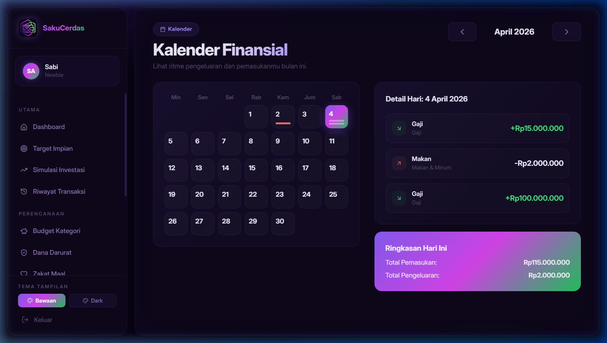

---

### 11. Literasi Keuangan (Financial Insights)
Feed berita ekonomi dan tips finansial paling update yang diambil langsung menggunakan **GNews API Integration**.
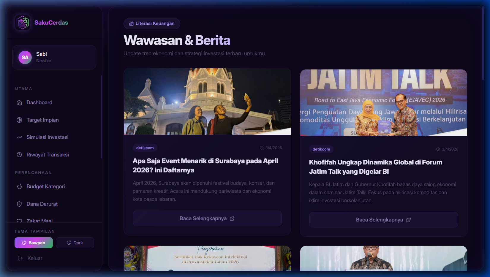

---

### 🔍 Filosofi Desain UI/UX
-   **Premium Glassmorphism**: Penggunaan efek latar belakang blur dan border halus untuk estetika modern.
-   **High Contrast Dark Mode**: Optimasi kenyamanan mata saat memantau data angka dalam waktu lama.
-   **Data-Driven Interface**: Setiap elemen dirancang untuk menonjolkan data penting bagi pengguna.
